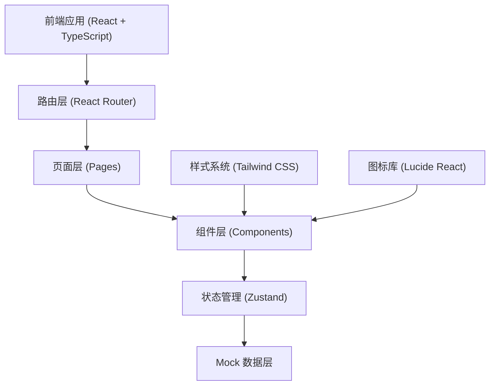
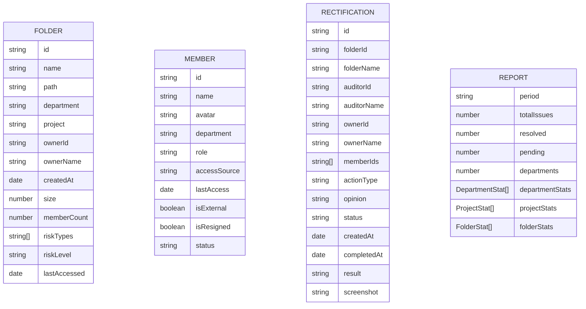

## 1. 架构设计



## 2. 技术描述

- **前端框架**：React@18 + TypeScript
- **构建工具**：Vite@5
- **路由管理**：react-router-dom@6
- **状态管理**：zustand@4
- **样式方案**：Tailwind CSS@3
- **图标组件**：lucide-react
- **数据可视化**：recharts
- **数据来源**：前端 Mock 数据（模拟后端 API）

## 3. 路由定义

| 路由路径 | 页面名称 | 说明 |
|----------|----------|------|
| / | 风险清单首页 | 四类风险分类展示、文件夹列表 |
| /folder/:id | 文件夹详情页 | 成员权限列表、整改操作、整改记录 |
| /todos | 待办中心 | 整改任务列表、处理回填 |
| /reports | 审计报告页 | 统计图表、多维度报表、导出 |

## 4. 数据模型

### 4.1 数据模型定义



### 4.2 类型定义

```typescript
// 风险类型
type RiskType = 'external_access' | 'resigned_access' | 'too_many_editors' | 'long_unaccessed';

// 风险等级
type RiskLevel = 'high' | 'medium' | 'low';

// 成员角色
type MemberRole = 'owner' | 'editor' | 'viewer' | 'commenter';

// 整改状态
type RectificationStatus = 'pending' | 'processing' | 'completed' | 'cancelled';

// 文件夹
interface Folder {
  id: string;
  name: string;
  path: string;
  department: string;
  project: string;
  ownerId: string;
  ownerName: string;
  createdAt: string;
  size: number;
  memberCount: number;
  riskTypes: RiskType[];
  riskLevel: RiskLevel;
  lastAccessed: string;
}

// 成员
interface Member {
  id: string;
  name: string;
  avatar?: string;
  department: string;
  role: MemberRole;
  accessSource: string;
  lastAccess: string;
  isExternal: boolean;
  isResigned: boolean;
  status: 'active' | 'inactive';
}

// 整改记录
interface Rectification {
  id: string;
  folderId: string;
  folderName: string;
  auditorId: string;
  auditorName: string;
  ownerId: string;
  ownerName: string;
  memberIds: string[];
  memberNames: string[];
  actionType: string;
  opinion: string;
  status: RectificationStatus;
  createdAt: string;
  completedAt?: string;
  result?: string;
  screenshot?: string;
}

// 部门统计
interface DepartmentStat {
  name: string;
  totalIssues: number;
  resolved: number;
  pending: number;
}

// 审计报告
interface AuditReport {
  period: string;
  totalIssues: number;
  resolved: number;
  pending: number;
  completionRate: number;
  departmentStats: DepartmentStat[];
}
```

## 5. 项目结构

```
src/
├── components/          # 公共组件
│   ├── Layout/         # 布局组件（侧边栏、顶部栏）
│   ├── RiskCard/       # 风险卡片
│   ├── DataTable/      # 数据表格
│   ├── StatusTag/      # 状态标签
│   └── Modal/          # 弹窗组件
├── pages/              # 页面组件
│   ├── RiskList/       # 风险清单首页
│   ├── FolderDetail/   # 文件夹详情页
│   ├── TodoCenter/     # 待办中心
│   └── AuditReport/    # 审计报告页
├── store/              # 状态管理
│   ├── useFolderStore.ts
│   ├── useRectificationStore.ts
│   └── useReportStore.ts
├── data/               # Mock 数据
│   ├── folders.ts
│   ├── members.ts
│   └── rectifications.ts
├── types/              # 类型定义
│   └── index.ts
├── utils/              # 工具函数
│   ├── format.ts
│   └── date.ts
├── App.tsx
├── main.tsx
└── index.css
```

## 6. 核心模块说明

### 6.1 风险清单模块
- 四类风险统计卡片
- 文件夹列表（支持排序、筛选、搜索）
- 风险标签和等级展示

### 6.2 文件夹详情模块
- 基本信息展示
- 成员权限列表（多选、批量操作）
- 整改申请弹窗
- 整改记录时间线

### 6.3 待办中心模块
- 待办任务列表
- 状态筛选
- 整改回填表单（含截图上传）

### 6.4 审计报告模块
- 核心指标概览
- 部门维度柱状图
- 明细数据表格
- 报告导出功能
